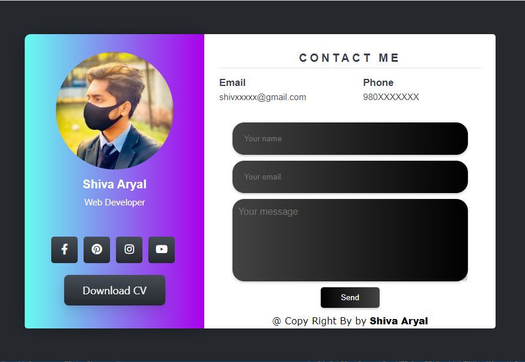

# Shiva Profile

This project is a personal profile page featuring a modern design with a profile picture, contact details, and a form. The page is styled using CSS to create a visually appealing layout with a gradient background and custom button styling.

## Preview



## Features

- **Profile Section**: Includes a profile picture, name, and title.
- **Social Media Links**: Icons linked to social media profiles.
- **Contact Information**: Displays email and phone number.
- **Contact Form**: Allows users to send a message directly.
- **Download CV Button**: Provides an option to download the CV.

## Files Included

- `index.html` - The HTML structure of the profile page.
- `style.css` - The CSS file for styling the profile page.

## Usage

1. **Clone the Repository**:
   ```bash
   git clone https://github.com/aryalshiva/my-contact-id
